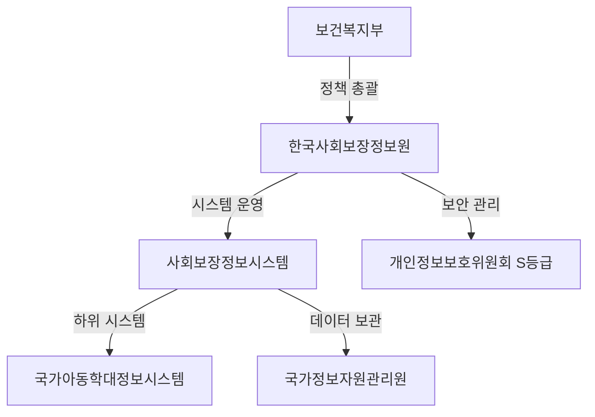
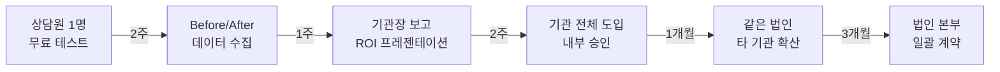

# 🛡️ Linker(링커) — 규제 장벽 분석 및 사업 전략

> **사회보장정보시스템 개인정보처리방침 분석을 기반으로 한 리스크 식별 및 GTM 전략 수립**

---

## 1. 개인정보처리방침 PDF에서 발견한 핵심 사실

### 1.1 아동학대정보시스템과 사회보장정보시스템의 관계

PDF 문서(2025년 4분기)에서 **아동학대 조사 공공화 피해아동 정보** 및 **아동학대 조사 공공화 행위자 정보**가 개인정보 영향평가 대상으로 명시되어 있습니다.

| 항목 | 내용 |
|---|---|
| **운영 주체** | 보건복지부 (구축), 한국사회보장정보원 (운영) |
| **데이터 보관** | 국가정보자원관리원 (대전) — 2~3중 백업 |
| **보안 등급** | 2024년 개인정보 보호수준 평가 **'S등급'** (최고 등급) |
| **인증 방식** | 공무원: GPKI, 업무종사자(민간): NPKI → **인증서 기반 로그인** |
| **수집 개인정보** | 주민등록번호, 가족관계, 소득/재산, 건강정보, 장애정보, 학력 등 **초민감 정보** |
| **보유 기간** | 대부분 5년, 일부 영구/30년/준영구 |

### 1.2 아동학대 관련 데이터의 특수성

```
아동학대 조사 공공화 시스템에서 처리하는 정보:
- 피해아동: 이름, 생년월일, 성별, 국적, 장애유형, 보호조치이력, 법적조치이력
- 행위자: 이름, 주민등록번호, 관계, 직업, 전과이력
- 보유기간: "영구"
```

> [!CAUTION]
> 아동학대정보는 **형사사법 정보**와 결합된 초고민감 데이터입니다. 이 데이터에 대한 비인가 접근, 유출, 오입력은 **형사처벌 대상**이 될 수 있습니다.

---

## 2. 리스크 분석: 5대 핵심 장벽

### 🔴 장벽 1: 시스템 접근 불가능성 (심각도: Critical)

**현실**: 국가아동학대정보시스템은 **사회보장정보시스템의 하위 시스템**으로, 접근 자체가 극도로 제한됩니다.

| 접근 조건 | 상세 |
|---|---|
| 인증 | NPKI(민간) 또는 GPKI(공무원) 인증서 필수 |
| 접속 IP | 기관 내부 네트워크에서만 접속 가능 (VPN 또는 전용회선) | - 확실치 않음
| 권한 | 기관별·역할별 접근 권한 부여 (개인별 ID) | 
| 감사 추적 | **모든 접속·조회·수정 기록이 로그**로 남음 |
| 접속기록 보관 | 최소 2년 이상 보관 |

> [!IMPORTANT]
> **우리 프로그램(Linker)이 시스템에 "접근"하는 것이 아닙니다.** Linker는 이미 정당한 권한으로 로그인한 사용자의 브라우저를 **UI 레벨에서 조작**하는 것입니다. 이 구분이 법적으로 매우 중요합니다.

**대응 전략**:
- Linker는 API 호출이나 DB 직접 접근을 **하지 않음** — UI 자동화(RPA)만 수행
- 사용자가 직접 로그인한 세션을 활용 → 기존 인증 체계를 우회하지 않음
- 접속 기록에는 **기존 사용자의 ID로 정상 기록**됨

---

### 🔴 장벽 2: 개인정보보호법 준수 (심각도: Critical)

PDF에서 확인된 법적 근거:

| 법률 | 관련 조항 | Linker에 대한 영향 |
|---|---|---|
| **개인정보 보호법** | 제15조(수집·이용), 제17조(제3자 제공) | Linker가 개인정보를 수집·저장하면 위반 |
| **사회복지사업법** | 제6조의2(전자화) | 시스템 외 도구 사용에 대한 규정 모호 |
| **사회보장기본법** | 제37조(시스템 구축·운영) | 비인가 시스템의 데이터 처리 제한 |
| **아동학대처벌법** | 비밀누설 금지 | 아동학대 관련 정보 유출 시 5년 이하 징역 |

**핵심 질문**: Linker가 엑셀 파일을 읽어서 브라우저에 입력하는 과정에서, **개인정보를 "처리"하는 것인가?**

```
개인정보 보호법상 "처리"의 정의:
수집, 생성, 연계, 연동, 기록, 저장, 보유, 가공, 편집, 검색, 
출력, 정정, 복구, 이용, 제공, 공개, 파기, 그 밖에 이와 유사한 행위
```

> [!WARNING]
> 엑셀 파일을 파싱(읽기)하는 것 자체가 **"수집"**에 해당할 수 있습니다. Linker가 개인정보처리자(또는 수탁자)가 되지 않으려면, **데이터를 메모리에서만 처리하고 어떤 형태로도 저장·전송하지 않아야** 합니다.

**대응 전략**:
1. **Zero Storage 아키텍처**: 엑셀 데이터는 메모리에서만 처리, 디스크에 쓰지 않음
2. **로그에 개인정보 미포함**: 에러 로그에도 개인식별정보를 마스킹 처리
3. **Supabase에 개인정보 전송 절대 금지**: 인증/라이선스 확인만 전송
4. **개인정보 영향평가(PIA) 자체 실시**: 배포 전 자체 PIA를 수행하여 문서화

---
  
### 🟠 장벽 3: 데이터 파기 및 관리 의무 (심각도: High)

PDF 제7조에 의하면:

```
개인정보의 파기에 관한 사항:
- 보유기간 경과 시 지체 없이 파기
- 전자적 파일: 복원 불가능 방법으로 영구 삭제
- 인쇄물: 파쇄 또는 소각
```

**Linker 관련 리스크**:
- 엑셀 파일 자체가 개인정보 파일 → 이미 기관이 관리해야 할 대상
- Linker가 임시 파일, 캐시, 로그를 남기면 **파기 의무 발생**
- Windows 임시 폴더에 데이터 잔재가 남을 가능성

**대응 전략**:
1. 프로그램 종료 시 **메모리 완전 클리어**
2. 임시 파일 생성하지 않는 설계
3. 로그 파일은 **작업 건수·성공/실패만 기록** (개인정보 없이)
4. 기관 담당자에게 **엑셀 파일 파기 가이드라인 별도 제공**

---

### 🟠 장벽 4: 위탁 및 제3자 제공 규제 (심각도: High)

PDF 제8조에 의하면, 개인정보처리 위탁 시:

```
위탁 시 필수 요건:
- 위탁계약서에 개인정보 보호 관련 사항 명시
- 수탁자에 대한 관리·감독
- 위탁 사실을 정보주체에게 공지
```

**핵심 쟁점**: Linker 개발사가 **수탁자**로 간주될 수 있는가?

| 시나리오 | 수탁자 해당 여부 | 근거 |
|---|---|---|
| Linker가 로컬에서만 작동, 데이터 비전송 | ❌ 미해당 | 개인정보를 위탁받지 않음 |
| Linker가 Supabase로 사용 통계 전송 (개인정보 미포함) | ❌ 미해당 | 개인정보 포함 안됨 |
| 향후 클라우드에서 데이터 처리 추가 시 | ⚠️ **해당 가능** | 개인정보 제3자 제공으로 간주 |

**대응 전략**:
- **절대 클라우드 처리 모델 채택 금지** (최소 초기 단계에서)
- 프로그램은 "도구(Tool)"일 뿐, 개인정보처리자가 아님을 명확히 문서화
- 법률 자문을 받아 **이용약관에 면책 조항** 명시

---

### 🟡 장벽 5: 사회보장정보원의 정책적 반대 가능성 (심각도: Medium)

PDF에서 확인된 시스템 운영 거버넌스:



**가능한 반대 시나리오**:
1. 사회보장정보원이 **RPA 사용 금지 공문** 발행
2. 시스템 업데이트 시 **RPA 차단 기술** 도입 (CAPTCHA 등)
3. 보안 감사에서 RPA 사용 기관에 **제재**

**대응 전략**:
1. 사전에 사회보장정보원에 **비공식 의견 타진** (적대적 관계 방지)
2. "시스템 사용 만족도 향상" 관점으로 접근 → **협력 파트너로 포지셔닝**
3. 장기적으로 **공식 API 또는 연동 가이드 제공 요청**
4. 리스크 분산: 사회보장정보원 승인 전까지는 **"내부 업무 도구"로만 포지셔닝**

---

## 3. 사업 전략: "어떻게 팔 것인가?"

### 3.1 판매 대상별 공략 전략

#### 🏢 A. 개별 아동보호전문기관 (Bottom-Up)

| 항목 | 전략 |
|---|---|
| **구매 의사결정자** | 기관장 (전결 가능 금액: 연 100만 원 이하) |
| **사용 의사결정자** | 상담원 (현장 사용자) |
| **구매 예산 항목** | "전산운영비" 또는 "사무용품비" 내 집행 |
| **판매 메시지** | "야근 50% 감소, 실적 보고 정확도 100%" |
| **판매 방법** | 무료 체험 1개월 → 사용 후기 확보 → 유료 전환 |

#### 🏛️ B. 위탁법인 본부 (Top-Down)

**주요 타겟**: 굿네이버스, 초록우산 어린이재단, 세이브더칠드런, 중앙아동보호전문기관

| 항목 | 전략 |
|---|---|
| **의사결정자** | IT사업부장 또는 경영지원실장 |
| **구매 단위** | 산하 전체 기관 일괄 계약 (10~20개 기관) |
| **판매 메시지** | "산하 기관 전체 업무 효율화 + ESG 디지털 전환 사례" |
| **가격** | 기관당 연 40만 원 (볼륨 디스카운트) × 15개 기관 = **연 600만 원** |
| **부가 가치** | 법인 본부용 대시보드, 사용 현황 리포트 제공 |

> [!TIP]
> 위탁법인들은 **사회적 가치 보고서(ESG)**를 매년 발행합니다. "디지털 혁신으로 상담원 업무 부담 경감"은 훌륭한 ESG 스토리가 됩니다.

#### 🏛️ C. 정부·공공기관 채널 (장기)

| 채널 | 방법 | 기대 효과 |
|---|---|---|
| 보건복지부 디지털 혁신 공모 | 사회복지 현장 디지털 혁신 사업에 제안 | 개발비 확보 + 공식 도입 채널 |
| 사회보장정보원 협력 | 시스템 사용 만족도 조사 결과와 연계 제안 | 공식 인정 + 시스템 연동 가능 |
| 지자체 사회복지 예산 | 시·도 단위 아동보호 업무 지원 예산 확보 | 지방비로 기관 도입비 지원 |

---

### 3.2 법적 리스크를 "신뢰"로 전환하는 전략

**문제**: "개인정보 문제는 없나요?" (기관장의 #1 우려)

**솔루션**: 리스크를 정면 돌파하여 **신뢰 자산**으로 만들기

```
[신뢰 구축 3단계 전략]

Step 1: "보안 설계 문서" 제공
  └─ Linker의 데이터 처리 흐름도
  └─ Zero Storage 아키텍처 설명
  └─ 어떤 데이터도 외부 전송하지 않음을 기술적으로 증명

Step 2: "개인정보 영향평가(PIA) 자체 보고서" 작성
  └─ 개인정보 보호법 제33조에 근거
  └─ 전문 법률 자문을 받아 작성
  └─ 기관 보안 담당자에게 제출

Step 3: "기관 보안 정책 호환성 체크리스트" 제공
  └─ 기관 방화벽/보안 프로그램과의 호환 확인
  └─ exe 파일 화이트리스트 등록 절차 안내
  └─ IT 담당자용 기술 FAQ
```

---

### 3.3 구체적 세일즈 시퀀스



#### 프레젠테이션 핵심 슬라이드

| # | 제목 | 내용 |
|---|---|---|
| 1 | **문제** | "DB 입력에 매일 1~2시간, 연간 500시간을 소모하고 있습니다" |
| 2 | **데모 영상** | Before(5분) vs After(30초) 실제 입력 화면 비교 |
| 3 | **안전성** | "데이터는 절대 외부로 나가지 않습니다" — 기술 구조도 |
| 4 | **비용** | "상담원 1명의 야근 수당(월 30만 원) vs Linker(월 5만 원)" |
| 5 | **도입 실적** | "○○ 기관에서 이미 사용 중" (초기 레퍼런스) |

---

## 4. 재무 시나리오 (3년)

### 보수적 시나리오

| 연차 | 도입 기관 수 | 기관당 연매출 | 연매출 | 비용 | 순이익 |
|---|---|---|---|---|---|
| **1년차** | 5개 | 60만 원 | 300만 원 | 500만 원 | -200만 원 |
| **2년차** | 20개 | 60만 원 | 1,200만 원 | 800만 원 | 400만 원 |
| **3년차** | 50개 + 법인 2곳 | 50만 원 (평균) | 3,500만 원 | 1,500만 원 | 2,000만 원 |

### 낙관적 시나리오 (법인 본부 일괄 계약 성공 시)

| 연차 | 도입 기관 수 | 연매출 | 비고 |
|---|---|---|---|
| **1년차** | 15개 | 900만 원 | 굿네이버스 산하 일부 |
| **2년차** | 40개 | 2,400만 원 | 2개 법인 + 개별 기관 |
| **3년차** | 75개 + 타 복지 영역 | 6,000만 원+ | 요양원, 장애인복지관 확장 |

---

## 5. 실행 로드맵

### Phase 0: 복무 중 (지금 ~ 소집해제)

| 주 | 할 일 | 산출물 |
|---|---|---|
| 1~2 | 기술 검증 (Ctrl+V, F12, 보안 프로그램) | PoC 영상 |
| 3~4 | MVP 개발 (단건 자동 입력) | 작동하는 프로토타입 |
| 5~6 | 대전 기관 상담원 1~3명 무료 테스트 | Before/After 데이터 |
| 7~8 | 보안 설계 문서 + PIA 자체 보고서 작성 | 보안 문서 |
| 9~12 | 기관장 보고 + 내부 공식 승인 | 기관 도입 승인서 |

### Phase 1: 소집해제 후 6개월

| 월 | 할 일 |
|---|---|
| 1~2 | 법률 자문 (개인정보보호법 준수 확인), 사업자 등록 |
| 3~4 | 대전 기관 공식 도입 + 같은 법인 타 기관 접촉 |
| 5~6 | 법인 본부 미팅 + 창업 지원사업 지원 |

### Phase 2: 7~12개월

| 월 | 할 일 |
|---|---|
| 7~9 | 법인 일괄 계약 추진 + 전국 아보전 네트워크 마케팅 |
| 10~12 | 타 복지 시스템(사회서비스정보시스템 등) 확장 검토 |

---

## 6. 결론: 3가지 핵심 인사이트

### 💡 1. "접근 불가"가 아니라 "접근 방식의 문제"

Linker는 시스템에 직접 접근하는 것이 아닙니다. **이미 인가된 사용자가 하는 작업을 자동화**하는 것입니다. 이 프레이밍이 법적으로, 영업적으로 가장 중요합니다.

핵심 문장: *"Linker는 시스템에 접근하지 않습니다. 사용자의 손가락을 대신해줄 뿐입니다."*

### 💡 2. "보안 리스크"가 아니라 "보안 향상 도구"

현재 상담원들은 개인정보가 가득한 엑셀 파일을 **수동으로 복붙**하며 오입력 리스크를 감수하고 있습니다. Linker는 오히려:
- 오입력(잘못된 아동에게 기록)을 **방지**
- 동명이인 처리를 **명시적으로 경고**
- 입력 완료 후 **검증 가능한 로그** 제공

### 💡 3. "규제가 곧 MOAT(해자)"

개인정보보호법, 보안 요건, 기관 PC 정책 등의 규제 장벽은 **대형 SaaS 업체의 진입도 막는 방어막**입니다. 이 장벽을 뚫는 데 성공하면, **그 자체가 경쟁 우위**가 됩니다:

```
[규제 장벽의 역설]

높은 규제 → 대기업/범용 RPA 진입 어려움
              ↓
도메인 전문성 + 현장 이해 → Linker만 통과 가능
              ↓
한번 도입되면 교체 비용 높음 → 높은 고객 유지율
              ↓
규제가 있을수록 Linker의 MOAT가 강화됨
```

---

> **다음 액션**: 법률 자문(개인정보보호 전문 변호사)을 받아 "로컬 RPA 도구가 개인정보 처리에 해당하는지"에 대한 공식 의견서를 확보하는 것이 최우선 과제입니다.
