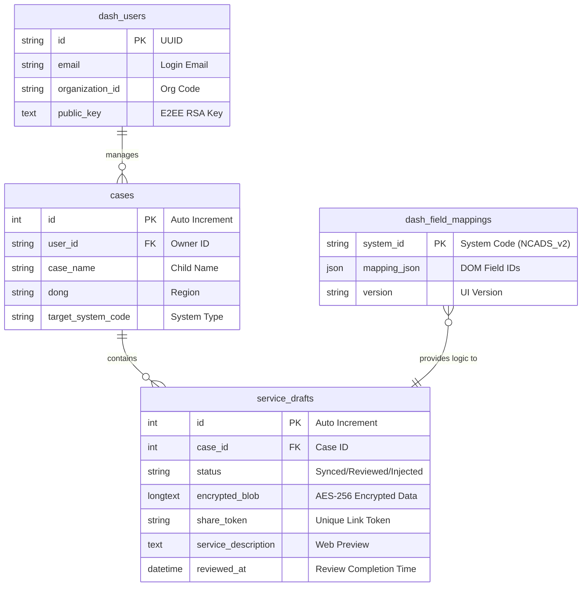

# Dash Database 가이드 (v1.5)

이 문서는 Dash 시스템의 데이터 저장 구조와 각 구성 요소 간의 관계를 설명합니다. 이 설계는 **보안(E2EE)** 및 **실시간 업무 프로세스 자동화**에 최적화되어 있습니다.

---

## 1. ERD (Entity Relationship Diagram)

---

## 2. 테이블 상세 정의

### 2.1 `dash_users` (상담원 정보)
상담원의 계정 정보와 보안 통신을 위한 키를 관리합니다.

| 컬럼명 | 타입 | 설명 | 비고 |
| :--- | :--- | :--- | :--- |
| `id` | VARCHAR(36) | 고유 식별자 (PK) | UUID 권장 |
| `email` | VARCHAR(255) | 로그인 및 연락용 이메일 | UNIQUE |
| `organization_id` | VARCHAR(100) | 소속 기관 코드 | 기관별 템플릿 필터링용 |
| `public_key` | TEXT | E2EE용 RSA 공개키 | 원문 데이터 암호화 통신용 |

### 2.2 `cases` (상담 사례/아동)
기록의 대상이 되는 아동 및 사례 정보를 정의합니다.

| 컬럼명 | 타입 | 설명 | 비고 |
| :--- | :--- | : :--- | :--- |
| `id` | INT | 사례 고유 번호 (PK) | AUTO_INCREMENT |
| `user_id` | VARCHAR(36) | 담당 상담원 식별자 (FK) | `dash_users` 테이블 참조 |
| `case_name` | VARCHAR(100) | 아동 이름 또는 사례명 | - |
| `dong` | VARCHAR(50) | 담당 지역 (예: 선화동) | - |
| `target_system_code` | VARCHAR(50) | 주입될 정부 시스템 종류 | 기본값: NCADS_v2 |

### 2.3 `service_drafts` (상담 데이터 및 상태)
시스템의 핵심 데이터가 저장되는 곳으로, 업무 단계별 상태를 관리합니다.

| 컬럼명 | 타입 | 설명 | 비고 |
| :--- | :--- | :--- | :--- |
| `id` | INT | 기록 고유 번호 (PK) | AUTO_INCREMENT |
| `case_id` | INT | 소속 사례 번호 (FK) | `cases` 테이블 참조 |
| `status` | ENUM | 현재 업무 단계 상태 | **Synced**, Reviewed, Injected 순 |
| `encrypted_blob` | LONGTEXT | **AES-256 암호화 데이터** | 서버 보안 금고 역할 |
| `share_token` | VARCHAR(100) | 웹 공유 링크용 보안 토큰 | UNIQUE |
| `service_description` | TEXT | 웹 미리보기용 평문 일부 | (선택) 편집 편의성 제공 |
| `reviewed_at` | DATETIME | 검토 완료 시점 | - |

### 2.4 `dash_field_mappings` (매핑 엔진)
확장 프로그램이 웹사이트의 어떤 칸(Input/ID)에 데이터를 넣어야 할지 정의합니다.

| 컬럼명 | 타입 | 설명 | 비고 |
| :--- | :--- | :--- | :--- |
| `system_id` | VARCHAR(50) | 타겟 시스템 식별 코드 (PK) | 예: NCADS_V2_WEB |
| `mapping_json` | JSON | 필드 ID와 데이터명 간의 지도 | - |
| `version` | VARCHAR(20) | 매핑 정보의 버전 | 사이트 업데이트 대응용 |

---

## 3. 핵심 컬럼의 핵심 로직

### 📦 `encrypted_blob`
- **목적**: 서버 관리자나 해커가 DB를 열어봐도 상담 내용을 알 수 없게 하는 **보안 장치**.
- **작동**: Flutter 앱 내에서 AES-256 암호화를 수행한 후, 암호화된 문자열(Base64)을 이 필드에 담습니다. 복호화 키는 서버에 저장되지 않습니다.

### 🚥 `status` (데이터 생명 주기)
- **`Synced` (동기화됨)**: 모바일 저장 즉시 부여. **크롬 확장 프로그램에 즉시 노출됨.**
- **`Reviewed` (검토됨)**: 웹에서 검토 완료 버튼을 누른 상태. **모바일/확장 프로그램에서 초록색 체크 뱃지 표시.**
- **`Injected` (입력 완료)**: 확장 프로그램을 통해 실제 정부 시스템에 데이터가 입력된 상태.

---

## 5. 개인정보 보호 및 보안 설계 (Privacy & Security)

Dash 시스템은 개인정보보호법 및 관련 보안 체계를 준수하기 위하여 **'제로 트러스트(Zero-Trust)'** 및 **'원천 암호화'** 원칙을 핵심 설계로 채택하고 있습니다.

### 5.1 기술적 설계 원리: 종단간 암호화 (E2EE)
*   **Zero-Knowledge Architecture**: 서버는 데이터의 복호화 키(Secret Key)를 절대 보유하지 않습니다. 데이터는 생성자(상담원 모바일)가 암호화하고, 권한이 있는 수신자(상담원 본인의 PC 확장 프로그램)만 열 수 있습니다.
*   **AES-256-GCM 적용**: 현대 대칭키 암호화의 표준인 AES-256 알고리즘을 사용합니다. 특히 GCM 모드를 통해 데이터의 기밀성뿐만 아니라 전송 중 데이터가 위변조되지 않았음을 보장하는 무결성 검증을 동시에 수행합니다.
*   **키 격리**: 암호화 키는 서버 DB가 아닌 각 기기의 **안전한 저장소(Secure Storage / Hardware KeyChain)**에 보관되어 물리적으로 격리됩니다.

### 5.2 단계별 데이터 처리 보안
1.  **데이터 생성 (Mobile)**: 상담원 입력 완료 즉시 앱 내부 메모리상에서 AES-256으로 암호화하여 `encrypted_blob` 생성.
2.  **데이터 전송 (In-Transit)**: 모든 통신은 TLS 1.3(HTTPS)으로 암호화되어 전송 중 가로채기를 원천 차단합니다.
3.  **서버 저장 (At-Rest)**: 서버 DB에는 암호화된 `encrypted_blob`만 저장됩니다. DB 관리자나 서버 침입자가 데이터를 열람하더라도 실제 상담 내용은 식별이 불가능한 '글자 뭉치'로만 보입니다.
4.  **복호화 및 주입 (Extension)**: 상담원의 업무용 PC 확장 프로그램에서만 로컬 키를 통해 복호화가 진행됩니다. 복호화된 데이터는 디스크에 저장되지 않고 정부 시스템의 입력 박스(DOM)에 즉시 주입된 후 메모리에서 소거됩니다.

### 5.3 설계 결과 및 법규 준수
*   **개인정보 수집 최소화**: 서버 운영 주체는 사용자의 상담 원문 데이터를 '수집'하지 않고 암호화된 상태로 '릴레이'만 하므로, 개인정보 유출 위험을 최소화합니다.
*   **안전성 확보 조치**: 기술적/관리적 보호 조치를 시스템 아키텍처 수준에서 강제하여 개인정보처리방침의 보안 요구사항을 완벽히 이행합니다.
*   **책임성**: 사용자가 직접 웹에서 검토하고(`Reviewed`), 확장 프로그램을 통해 직접 주입 버튼을 누르는 과정을 통해 데이터 처리 과정에 대한 인간의 통제권(Human-in-the-loop)을 유지합니다.

